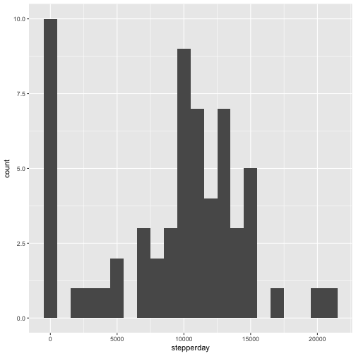
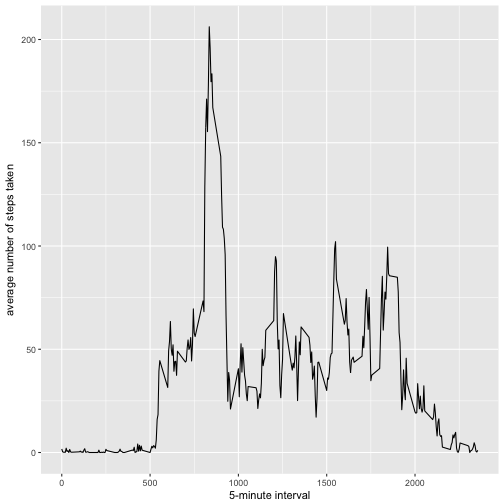
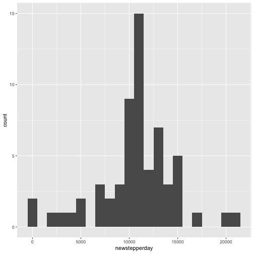
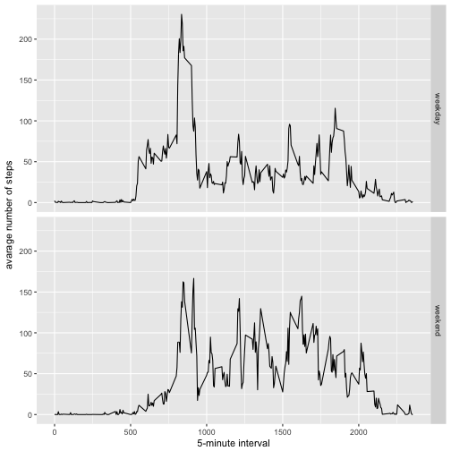

```r
---
title: "Course Project 1"
output: html_document
---
```

```
## Error: <text>:6:0: unexpected end of input
## 4: ---
## 5: 
##   ^
```


```r
library(ggplot2)
```

## Loading and preprocessing the data
### Load the data


```r
unzip('activity.zip')
act <- read.csv('activity.csv')
```

## What is mean total number of steps taken per day?
For this part of the assignment, you can ignore the missing values in the dataset.

### Calculate the total number of steps taken per day


```r
stepperday <- tapply(act$steps, act$date, FUN = sum, na.rm = TRUE)
stepperday
```

```
## 2012-10-01 2012-10-02 2012-10-03 2012-10-04 2012-10-05 2012-10-06 
##          0        126      11352      12116      13294      15420 
## 2012-10-07 2012-10-08 2012-10-09 2012-10-10 2012-10-11 2012-10-12 
##      11015          0      12811       9900      10304      17382 
## 2012-10-13 2012-10-14 2012-10-15 2012-10-16 2012-10-17 2012-10-18 
##      12426      15098      10139      15084      13452      10056 
## 2012-10-19 2012-10-20 2012-10-21 2012-10-22 2012-10-23 2012-10-24 
##      11829      10395       8821      13460       8918       8355 
## 2012-10-25 2012-10-26 2012-10-27 2012-10-28 2012-10-29 2012-10-30 
##       2492       6778      10119      11458       5018       9819 
## 2012-10-31 2012-11-01 2012-11-02 2012-11-03 2012-11-04 2012-11-05 
##      15414          0      10600      10571          0      10439 
## 2012-11-06 2012-11-07 2012-11-08 2012-11-09 2012-11-10 2012-11-11 
##       8334      12883       3219          0          0      12608 
## 2012-11-12 2012-11-13 2012-11-14 2012-11-15 2012-11-16 2012-11-17 
##      10765       7336          0         41       5441      14339 
## 2012-11-18 2012-11-19 2012-11-20 2012-11-21 2012-11-22 2012-11-23 
##      15110       8841       4472      12787      20427      21194 
## 2012-11-24 2012-11-25 2012-11-26 2012-11-27 2012-11-28 2012-11-29 
##      14478      11834      11162      13646      10183       7047 
## 2012-11-30 
##          0
```

### Make a histogram of the total number of steps taken each day


```r
qplot(stepperday, geom = "histogram", binwidth = 1000)
```



### Calculate and report the mean and median of the total number of steps taken per day


```r
mean(stepperday, na.rm = TRUE)
```

```
## [1] 9354.23
```

```r
median(stepperday, na.rm = TRUE)
```

```
## [1] 10395
```

## What is the average daily activity pattern?
### Make a time series plot of the 5-minute interval (x-axis) and the average number of steps taken, averaged across all days (y-axis)


```r
avg <- aggregate(x = list(steps = act$steps), by = list(interval = act$interval), 
    FUN = mean, na.rm = TRUE)
ggplot(data = avg, aes(x = interval, y = steps)) + geom_line() + xlab("5-minute interval") + 
    ylab("average number of steps taken")
```



### Which 5-minute interval, on average across all the days in the dataset, contains the maximum number of steps?


```r
avg[which.max(avg$steps), ]
```

```
##     interval    steps
## 104      835 206.1698
```

## Imputing missing values
Note that there are a number of days/intervals where there are missing values (coded as \color{red}{\verb|NA|}NA). The presence of missing days may introduce bias into some calculations or summaries of the data.

### Calculate and report the total number of missing values in the dataset 


```r
table(is.na(act$steps))
```

```
## 
## FALSE  TRUE 
## 15264  2304
```


### Devise a strategy for filling in all of the missing values in the dataset. The strategy does not need to be sophisticated. 

Replace each missing value with the mean value of its 5-minute interval


```r
fill <- function(steps, interval) {
    filled <- NA
    if (!is.na(steps)) 
        filled <- c(steps) 
    else filled <- (avg[avg$interval == interval, "steps"])
    return(filled)
}
```

### Create a new dataset that is equal to the original dataset but with the missing data filled in.


```r
newact <- act
newact$steps <- mapply(fill, newact$steps, newact$interval)
```

### Make a histogram of the total number of steps taken each day and Calculate and report the mean and median total number of steps taken per day. Do these values differ from the estimates from the first part of the assignment? What is the impact of imputing missing data on the estimates of the total daily number of steps?


```r
newstepperday <- tapply(newact$steps, newact$date, FUN = sum, na.rm = TRUE)
qplot(newstepperday, geom = "histogram", binwidth = 1000)
```



```r
mean(newstepperday)
```

```
## [1] 10766.19
```

```r
median(newstepperday)
```

```
## [1] 10766.19
```

They are different from the values from the first part.By imputing the missing values by mean of the interval, it makes the the total daily number of steps increased.

## Are there differences in activity patterns between weekdays and weekends?
### Create a new factor variable in the dataset with two levels – “weekday” and “weekend” indicating whether a given date is a weekday or weekend day.


```r
newact$dateType <-  ifelse(as.POSIXlt(newact$date)$wday %in% c(0,6), 'weekend', 'weekday')
```

### Make a panel plot containing a time series plot of the 5-minute interval (x-axis) and the average number of steps taken, averaged across all weekday days or weekend days (y-axis). 


```r
newavg <- aggregate(steps ~ interval + dateType, data = newact, mean)
ggplot(newavg, aes(interval, steps)) + 
    geom_line() + 
    facet_grid(dateType ~ .) +
    xlab("5-minute interval") + 
    ylab("avarage number of steps")
```


```
```

